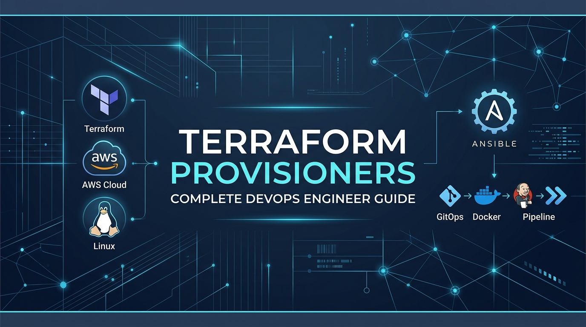
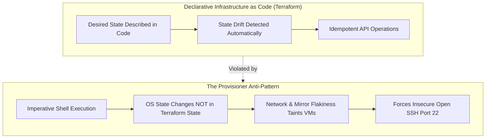
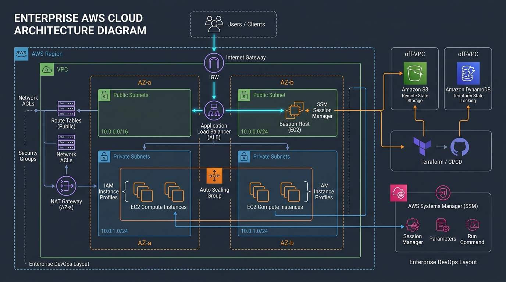
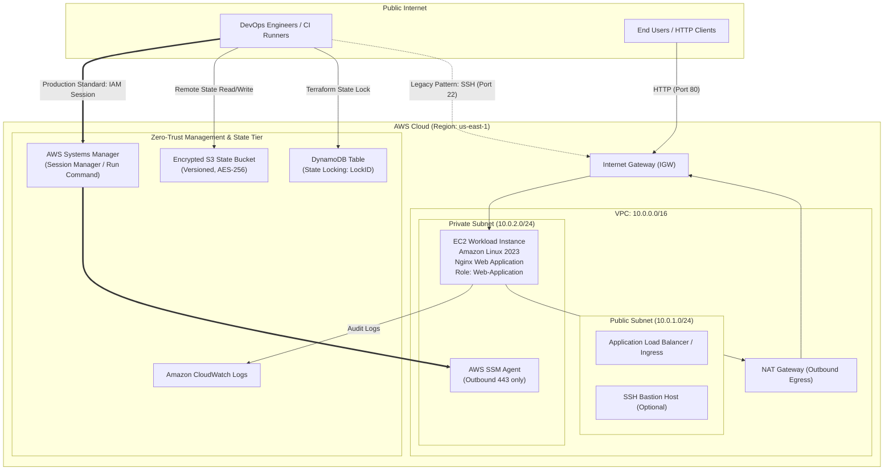
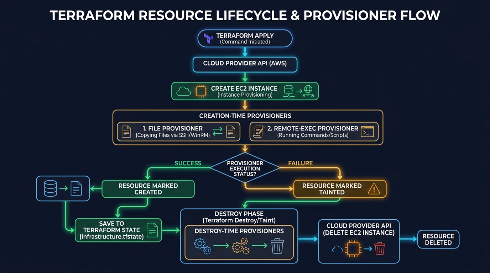
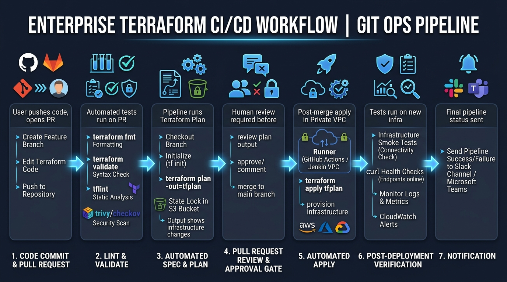
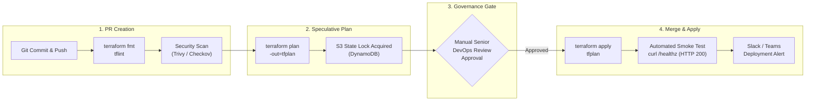
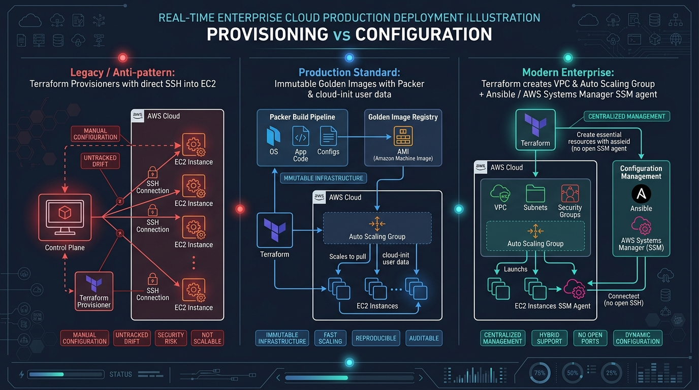

# Terraform Provisioners – Complete DevOps Engineer Guide



[](https://www.terraform.io/)
[](https://registry.terraform.io/providers/hashicorp/aws/latest)
[](LICENSE)
[](.github/workflows/terraform-ci.yml)
[](#production-alternatives-comparison)

> **Written from the perspective of a Senior DevOps & Cloud Infrastructure Engineer (8–10 years enterprise production experience) in AWS, Terraform, Linux, Ansible, Jenkins, GitHub Actions, Docker, Kubernetes, and IaC.**

---

## Executive Summary & Engineering Thesis

In enterprise cloud engineering, **Terraform Provisioners** (`local-exec`, `remote-exec`, `file`) occupy a unique and often misunderstood place. While frequently taught in beginner tutorials to run `apt-get install` or copy configuration files onto freshly minted EC2 instances, HashiCorp officially designates provisioners as a **"measure of last resort."**

### Why Are Provisioners a "Last Resort"?



1. **State Blindness**: Terraform maintains state for *cloud resources* (VPCs, Security Groups, EC2 instances), but has **zero visibility** into changes made inside the operating system by a shell script. If someone changes an Nginx config file manually on the host, `terraform plan` reports zero changes.
2. **The Tainted Resource Hazard**: If an EC2 instance launches successfully, but a subsequent `remote-exec` script encounters a package manager lock or transient network timeout, Terraform marks the entire EC2 instance as **tainted**. On the next `terraform apply`, Terraform **terminates and recreates the VM**, discarding data and causing unplanned downtime.
3. **Breach of Zero-Trust Network Architecture**: `remote-exec` requires opening inbound SSH (port 22) or WinRM (port 5986), demanding public IP addresses or complex bastion tunneling. In hardened enterprise environments, production instances live in private subnets with **zero inbound ports open**, managed exclusively via **AWS Systems Manager (SSM) Session Manager**.

### The Senior DevOps Mandate
This repository provides an **unflinching, industry-grade guide**:
* **Mastering Provisioners**: How `local-exec`, `remote-exec`, `file`, connection blocks, the `self` object, failure handling, and lifecycle triggers operate under the hood.
* **Hardening Patterns**: How to decouple provisioners using `null_resource` and `triggers` so failures never taint production VMs.
* **The Production Standard**: How enterprise teams replace provisioners with **Packer Golden AMIs**, **cloud-init / EC2 user_data**, **Ansible**, and **AWS Systems Manager**.

---

## Table of Contents

- [Architectural Overview](#architectural-overview)
- [Provisioner Lifecycle & State Machine](#provisioner-lifecycle--state-machine)
- [Repository Structure](#repository-structure)
- [The 20 Core DevOps Guide Topics](#the-20-core-devops-guide-topics)
- [Hands-on Production Project](#hands-on-production-project)
  - [Prerequisites](#prerequisites)
  - [Quickstart: Deploying with Provisioners](#quickstart-deploying-with-provisioners)
  - [Switching to Production Immutable User-Data](#switching-to-production-immutable-user-data)
  - [Verification & Smoke Testing](#verification--smoke-testing)
  - [Clean Teardown & Cost Management](#clean-teardown--cost-management)
- [CI/CD GitOps Pipeline Architecture](#cicd-gitops-pipeline-architecture)
- [Production Alternatives: The DevOps Matrix](#production-alternatives-the-devops-matrix)
- [Incident Response & Troubleshooting Runbooks](#incident-response--troubleshooting-runbooks)
- [Senior DevOps Interview Questions & Answers](#senior-devops-interview-questions--answers)
- [Enterprise Production Best Practices](#enterprise-production-best-practices)

---

## Architectural Overview



The reference architecture implements a dedicated multi-tier AWS Virtual Private Cloud (VPC) adhering to CIS AWS Foundations Benchmarks:



---

## Provisioner Lifecycle & State Machine



When Terraform provisions or destroys an infrastructure object, attached provisioners execute according to an explicit finite state machine:

```mermaid
sequenceDiagram
    autonumber
    actor CLI as Terraform Engine (Apply / Destroy)
    participant AWS as AWS Cloud API
    participant VM as EC2 Guest OS (SSH/WinRM)
    participant State as Remote State (S3 / DynamoDB)

    Note over CLI,AWS: 1. Resource Creation Phase
    CLI->>AWS: ec2:RunInstances (Create VM)
    AWS-->>CLI: Instance ID: i-0abc123 (State: running)

    Note over CLI,VM: 2. Creation-Time Provisioners Triggered (when = create)
    CLI->>VM: Establish Connection (SSH Port 22, Retries)
    VM-->>CLI: Handshake Established
    CLI->>VM: File Provisioner (Upload nginx.conf & bootstrap.sh)
    CLI->>VM: Remote-Exec Provisioner (Run bootstrap script)

    alt Scenario A: Provisioner Succeeded (Exit Code 0)
        VM-->>CLI: Execution Succeeded
        CLI->>CLI: Execute Local-Exec (Write audit record / Inventory)
        CLI->>State: Write resource state as CREATED
        Note over State: Resource Healthy & Monitored
    else Scenario B: Provisioner Failed (on_failure = fail)
        VM-->>CLI: Execution Failed
        CLI->>State: Mark Resource as TAINTED
        Note over State: Next apply will DESTROY and RECREATE instance!
    else Scenario C: Provisioner Failed (on_failure = continue)
        VM-->>CLI: Execution Failed
        CLI->>State: Log Warning; Mark Resource as CREATED
    end

    Note over CLI,AWS: 3. Resource Destruction Phase (when = destroy)
    CLI->>VM: Execute Destroy-Time Provisioner (Deregister from Consul/LB)
    VM-->>CLI: Cleanup Finished
    CLI->>AWS: ec2:TerminateInstances (Destroy VM)
    AWS-->>CLI: Instance Terminated
    CLI->>State: Remove Resource from State
```

---

## Repository Structure

```text
terraform-provisioners-guide/
├── .github/
│   └── workflows/
│       ├── terraform-ci.yml         # CI/CD: Lint, checkov scan, plan, auto-apply
│       └── terraform-destroy.yml    # Manual teardown workflow dispatch
├── assets/
│   └── images/                      # Enterprise architecture and lifecycle diagrams
│       ├── repo_banner.jpg
│       ├── aws_architecture.jpg
│       ├── provisioner_lifecycle.jpg
│       ├── cicd_pipeline_flow.jpg
│       └── production_deployment.jpg
├── cicd/
│   ├── jenkins/
│   │   └── Jenkinsfile              # Declarative multi-stage Jenkins pipeline
│   └── github-actions/
│       └── deploy.sh                # Containerized pipeline automation wrapper
├── configs/
│   ├── nginx.conf                   # Hardened production Nginx configuration
│   ├── app.service                  # Systemd service unit definition
│   ├── application.env.tpl          # Dynamic environment configuration template
│   └── inventory.ini.tpl            # Dynamic Ansible inventory rendered by local-exec
├── docs/
│   ├── 01-iac-and-provisioners-fundamentals.md       # IaC theory & provisioner basics
│   ├── 02-provisioner-deep-dive.md                   # local-exec, remote-exec, file syntax
│   ├── 03-lifecycle-connections-failure-handling.md  # State machine, tainted, S3 backend
│   ├── 04-production-alternatives-comparison.md      # cloud-init, Packer, Ansible, SSM
│   ├── 05-troubleshooting-and-incident-recovery.md   # Production incident runbooks
│   └── 06-devops-interview-qa.md                     # 15+ Senior DevOps interview Q&As
├── environments/
│   ├── dev/                         # Dev environment overlay (Provisioner mode)
│   └── prod/                        # Prod environment overlay (Immutable user-data mode)
├── examples/
│   ├── 01-local-exec/               # Standalone: local-exec, interpreters, webhooks
│   ├── 02-remote-exec/              # Standalone: remote-exec, inline vs scripts
│   ├── 03-file-provisioner/         # Standalone: single file, directory, inline content
│   ├── 04-combined-null-resource/   # Standalone: Decoupled null_resource with triggers
│   └── 05-destroy-provisioner/      # Standalone: when = destroy & self.triggers rules
├── modules/
│   ├── vpc/                         # Dedicated VPC, subnets, route tables, IGW
│   ├── security-groups/             # Least-privilege firewall rules
│   ├── iam/                         # IAM Role with SSM & CloudWatch instance profile
│   └── ec2-app/                     # EC2 Instance with decoupled provisioners & user-data
├── scripts/
│   ├── bootstrap.sh                 # Linux bash bootstrap (Idempotent, AL2023/Ubuntu)
│   ├── health_check.sh              # Local/CI HTTP endpoint verification loop
│   ├── cleanup_node.sh              # Decommissioning script for destroy provisioners
│   └── deploy_verification.sh       # Automated format, validate, and health test
├── backend.tf                       # S3 Remote State + DynamoDB State Locking template
├── versions.tf                      # Terraform engine and provider version constraints
├── variables.tf                     # Root input variables with strict validations
├── terraform.tfvars.example         # Template configuration for environment settings
├── main.tf                          # Root module orchestration & inventory generation
├── outputs.tf                       # Public IP, Application URL, SSH, and SSM commands
├── Makefile                         # Unified CLI commands (fmt, validate, plan, apply, destroy)
├── .gitignore                       # Enterprise gitignore for Terraform & cloud secrets
├── LICENSE                          # MIT Open Source License
└── README.md                        # Master Documentation and Engineering Portfolio
```

---

## The 20 Core DevOps Guide Topics

| # | Topic | Documentation & Code Reference |
| :--- | :--- | :--- |
| **01** | Introduction to Terraform & Infrastructure as Code | [`docs/01-iac-and-provisioners-fundamentals.md`](docs/01-iac-and-provisioners-fundamentals.md#1-introduction-to-infrastructure-as-code-iac) |
| **02** | What Terraform Provisioners Are & Why They Are Used | [`docs/01-iac-and-provisioners-fundamentals.md`](docs/01-iac-and-provisioners-fundamentals.md#2-what-are-terraform-provisioners-and-why-are-they-used) |
| **03** | All Major Provisioners: `local-exec`, `remote-exec`, `file` | [`docs/02-provisioner-deep-dive.md`](docs/02-provisioner-deep-dive.md) & [`examples/`](examples/) |
| **04** | Creation-Time vs. Destroy-Time Provisioners (`when = destroy`) | [`examples/05-destroy-provisioner/`](examples/05-destroy-provisioner/) |
| **05** | Connection Blocks, SSH, WinRM, and the `self` Object | [`docs/02-provisioner-deep-dive.md`](docs/02-provisioner-deep-dive.md#5-terraform-connection-blocks--ssh-bastion-tunneling) |
| **06** | `on_failure` Behavior (`continue` vs. `fail`) | [`docs/02-provisioner-deep-dive.md`](docs/02-provisioner-deep-dive.md#7-on_failure-behavior-fail-vs-continue) |
| **07** | Resource Lifecycle & Provisioner Execution Flow | [`docs/01-iac-and-provisioners-fundamentals.md`](docs/01-iac-and-provisioners-fundamentals.md#4-terraform-resource-lifecycle--provisioner-execution-flow) |
| **08** | Complete AWS EC2 Infrastructure Example | [`modules/ec2-app/`](modules/ec2-app/) & [`main.tf`](main.tf) |
| **09** | Practical Linux Shell Scripting | [`scripts/bootstrap.sh`](scripts/bootstrap.sh) & [`scripts/health_check.sh`](scripts/health_check.sh) |
| **10** | Copying Configuration Files to Remote EC2 Hosts | [`examples/03-file-provisioner/`](examples/03-file-provisioner/) & [`configs/`](configs/) |
| **11** | Combining `file` and `remote-exec` Provisioners | [`examples/04-combined-null-resource/`](examples/04-combined-null-resource/) |
| **12** | Secure Remote State Management (S3 + DynamoDB Locking) | [`backend.tf`](backend.tf) & [`docs/03-lifecycle-connections-failure-handling.md`](docs/03-lifecycle-connections-failure-handling.md#3-remote-state-management-s3--dynamodb-locking) |
| **13** | Terraform in CI/CD Pipelines (Jenkins & GitHub Actions) | [`.github/workflows/`](.github/workflows/) & [`cicd/jenkins/Jenkinsfile`](cicd/jenkins/Jenkinsfile) |
| **14** | Production Deployment Architecture | [Architectural Overview](#architectural-overview) & [`modules/vpc/`](modules/vpc/) |
| **15** | AWS Networking, IAM Roles, Security Groups & SSH Hardening | [`modules/iam/`](modules/iam/) & [`modules/security-groups/`](modules/security-groups/) |
| **16** | Real-Time Incidents & Troubleshooting Runbooks | [`docs/05-troubleshooting-and-incident-recovery.md`](docs/05-troubleshooting-and-incident-recovery.md) |
| **17** | Production Alternatives: cloud-init, Packer, Ansible, SSM | [`docs/04-production-alternatives-comparison.md`](docs/04-production-alternatives-comparison.md) |
| **18** | Security, Scalability, Monitoring, Rollback & Disaster Recovery | [`docs/04-production-alternatives-comparison.md`](docs/04-production-alternatives-comparison.md#5-alternative-3-aws-systems-manager-ssm-run-command) |
| **19** | Senior DevOps Production Interview Questions & Answers | [`docs/06-devops-interview-qa.md`](docs/06-devops-interview-qa.md) |
| **20** | Complete End-to-End Hands-on Project | [Hands-on Production Project](#hands-on-production-project) |

---

## Hands-on Production Project

This end-to-end project provisions an automated, production-styled AWS Nginx application server using Terraform.

### Prerequisites

1. **Terraform CLI**: Version `>= 1.5.0` installed (`terraform version`).
2. **AWS CLI**: Version `>= 2.0` configured with valid credentials (`aws sts get-caller-identity`).
3. **Make Utility**: (Optional, for simplified commands via `Makefile`).

---

### Step 1: Initialize the Project

```bash
# Clone the repository
git clone https://github.com/someshtarra/terraform-provisioners-real-time-devops.git
cd terraform-provisioners-real-time-devops

# Initialize Terraform modules and provider plugins
make init
# Or: terraform init
```

**Expected Terminal Output:**
```text
Initializing modules...
- ec2_app in modules/ec2-app
- iam in modules/iam
- security_groups in modules/security-groups
- vpc in modules/vpc

Initializing provider plugins...
- Installing hashicorp/aws v5.x...
- Installing hashicorp/null v3.x...
- Installing hashicorp/tls v4.x...
- Installing hashicorp/local v2.x...

Terraform has been successfully initialized!
```

---

### Step 2: Validate Syntax and Formatting

```bash
make fmt
make validate
```

**Expected Terminal Output:**
```text
Success! The configuration is valid.
```

---

### Step 3: Review Execution Plan

```bash
make plan
```

Terraform evaluates your AWS account, discovers the latest Amazon Linux 2023 AMI via `data.aws_ami`, generates a 4096-bit RSA SSH key pair automatically via `tls_private_key`, and plans the creation of the VPC, subnets, routing tables, security groups, IAM instance profiles, and EC2 instance.

---

### Step 4: Deploy Using Provisioners Mode

```bash
# Deploys using file + remote-exec + local-exec
make apply
```

**What Happens Behind the Scenes:**
1. AWS creates the VPC and launches the EC2 instance in the public subnet.
2. Terraform's `null_resource.instance_provisioner` connects to the instance over SSH using the auto-generated TLS private key.
3. The `file` provisioner uploads [`configs/nginx.conf`](configs/nginx.conf) and [`scripts/bootstrap.sh`](scripts/bootstrap.sh) into `/tmp/`.
4. The `remote-exec` provisioner sets execute permissions, runs `sudo /tmp/bootstrap.sh`, installs Nginx, queries IMDSv2 metadata, renders an interactive HTML dashboard, and confirms local HTTP response.
5. The `local-exec` provisioner records an audit log to `deployment_audit.log` and renders [`inventory.ini`](configs/inventory.ini.tpl) for Ansible.

**Expected Terminal Output:**
```text
Apply complete! Resources: 14 added, 0 changed, 0 destroyed.

Outputs:

application_url = "http://54.210.45.12"
instance_id = "i-09ab761234cde5678"
instance_public_ip = "54.210.45.12"
public_subnet_id = "subnet-0123456789abcdef0"
security_group_id = "sg-0fedcba9876543210"
ssh_command = "ssh -i ./generated_keys/terraform-provisioners-guide-dev.pem ec2-user@54.210.45.12"
ssm_session_command = "aws ssm start-session --target i-09ab761234cde5678 --region us-east-1"
vpc_id = "vpc-0a1b2c3d4e5f6g7h8"
```

---

### Step 5: Verification & Smoke Testing

Run the automated verification test:

```bash
make verify
```

**Expected Terminal Output:**
```text
======================================================================
      TERRAFORM PROVISIONERS GUIDE - AUTOMATED VERIFICATION
======================================================================
[1/5] Checking Terraform formatting (terraform fmt -check)... PASSED
[2/5] Validating Terraform configuration (terraform validate)... PASSED
[3/5] Inspecting Terraform outputs...
      Instance Public IP : 54.210.45.12
      Application URL    : http://54.210.45.12
[4/5] Testing HTTP endpoint connectivity...
      Endpoint reachable: HTTP 200 OK!
[5/5] Verification scan complete.
======================================================================
```

Open `http://<INSTANCE_PUBLIC_IP>` in your web browser. You will see the dynamic **Terraform Provisioners Production Dashboard** displaying instance metadata queried in real time via IMDSv2.

---

### Step 6: Switching to Production Immutable User-Data

To demonstrate the enterprise production standard (zero open SSH ports, zero provisioners), toggle `provisioning_mode` to `user-data`:

```bash
make apply-userdata
# Or: terraform apply -var="provisioning_mode=user-data" -auto-approve
```

Terraform reconfigures the instance to boot directly via EC2 `user_data` and removes the SSH-coupled `null_resource`!

---

### Step 7: Clean Teardown & Cost Management

To avoid ongoing AWS cloud charges, decommission all resources:

```bash
make destroy
```

**Destroy-Time Provisioner Execution:**
Notice that before deleting the EC2 instance, Terraform invokes the `null_resource.destroy_cleanup` destroy provisioner, executing decommissioning hooks and logging the teardown to `deployment_audit.log`.

Finally, run `make clean` to remove local key pairs and temporary plan files:
```bash
make clean
```

---

## CI/CD GitOps Pipeline Architecture



### Automated Pipeline Lifecycle



The repository includes ready-to-run pipeline definitions for both **GitHub Actions** and **Jenkins**:
* [`.github/workflows/terraform-ci.yml`](.github/workflows/terraform-ci.yml): Automated format checking, Trivy security scanning, speculative plan comments, and automated apply on merge to `main`.
* [`cicd/jenkins/Jenkinsfile`](cicd/jenkins/Jenkinsfile): Enterprise declarative Jenkins pipeline featuring Docker agents, manual approval gates, credential binding, and post-deployment smoke verification.

---

## Production Alternatives: The DevOps Matrix



### Detailed Engineering Tradeoffs

```mermaid
flowchart TD
    subgraph Legacy["Legacy / Anti-Pattern"]
        L1["Terraform Provisioners"] --> L2["Direct SSH Port 22 Open"]
        L2 --> L3["Untracked Config Drift & Tainted VMs"]
    end

    subgraph ProductionStandard["Production Standard"]
        P1["Packer Golden AMIs"] --> P2["Pre-baked OS & Software"]
        P2 --> P3["EC2 Launch Template & ASG"]
        P3 --> P4["cloud-init / user_data (Minimal Runtime Boot)"]
    end

    subgraph ZeroTrustEnterprise["Zero-Trust Enterprise Management"]
        E1["AWS Systems Manager (SSM)"] --> E2["Zero Open Inbound Ports"]
        E2 --> E3["Full CloudTrail Audit Logging & Session Manager"]
    end
```



| Capability | Terraform Provisioners | EC2 User Data (`cloud-init`) | Ansible Orchestration | Packer Golden AMIs | AWS Systems Manager (SSM) |
| :--- | :--- | :--- | :--- | :--- | :--- |
| **Inbound Ports Required** | Port 22 (SSH) / 5986 (WinRM) | **None (0 Inbound)** | Port 22 (SSH) | None (0 Inbound) | **None (TLS Outbound 443 only)** |
| **Failure Impact** | Marks VM **TAINTED** (recreated!) | Error logged to OS log file | Playbook fails; VM intact | Build fails in CI; zero prod impact | Command fails in SSM Console |
| **Auto Scaling Support** | ❌ Cannot trigger on scale-out | ✅ Runs on every scaled VM | ⚠️ Requires dynamic polling | ✅ **Instant scaling (<45s)** | ✅ Via State Manager associations |
| **SOC2 / CIS Compliance** | ❌ Fails (open SSH, static keys) | ✅ Compliant | ⚠️ Key management overhead | ✅ Compliant (Immutable) | 🌟 **Gold Standard (IAM Auth)** |

---

## Incident Response & Troubleshooting Runbooks

### 1. SSH Connection Timeout (`dial tcp: i/o timeout`)
* **Root Cause**: Missing security group rule for ingress port 22, public subnet missing route to Internet Gateway (`0.0.0.0/0 -> igw-xxxx`), or connecting to a private IP without a Bastion.
* **Triage**:
  ```bash
  # Check if Security Group allows your public IP
  MY_IP=$(curl -s ifconfig.me)
  echo "Your IP: ${MY_IP}"
  aws ec2 describe-security-groups --group-ids sg-xxxx --region us-east-1
  ```
* **Runbook**: See [`docs/05-troubleshooting-and-incident-recovery.md`](docs/05-troubleshooting-and-incident-recovery.md#incident-runbook-1-ssh-connection-timeout--refused).

### 2. Script Failure & The Tainted Instance
* **Root Cause**: Temporary package repository outage or typo in script caused non-zero exit code. Terraform marked instance as tainted.
* **Triage**:
  ```bash
  # Untaint instance to prevent unwanted deletion
  terraform untaint module.ec2_app.aws_instance.app
  ```
* **Architectural Fix**: Wrap provisioners inside `null_resource` with `triggers` so failures never taint the underlying EC2 instance.

### 3. DynamoDB State Lock Deadlock
* **Root Cause**: CI runner was terminated abruptly while holding the DynamoDB mutex lock.
* **Resolution**:
  ```bash
  terraform force-unlock <LOCK_ID>
  ```

---

## Senior DevOps Interview Questions & Answers

The repository contains an exhaustive interview preparation guide in [`docs/06-devops-interview-qa.md`](docs/06-devops-interview-qa.md), including:

1. **Why does HashiCorp classify provisioners as a "last resort"?**
   * *Answer Summary*: Provisioners break declarative IaC guarantees, introduce untracked OS-level configuration drift, cause resources to become tainted upon script errors, and violate zero-trust network principles by requiring open SSH ports.
2. **What is the critical rule regarding destroy-time provisioners and resource attributes?**
   * *Answer Summary*: In `when = destroy` provisioners, expressions cannot reference other resources or computed attributes of `self`. Dynamic values (such as IPs or IDs) **must** be stored in the `triggers` block of a `null_resource` and accessed via `self.triggers.<attribute>`.
3. **How do you eliminate SSH keys and open port 22 in production?**
   * *Answer Summary*: Attach an IAM role with `AmazonSSMManagedInstanceCore` to the EC2 instance profile, install the AWS SSM Agent, and use AWS Systems Manager Session Manager or Run Command for zero-inbound-port administration.

---

## Enterprise Production Best Practices

1. **Decouple Provisioners from Core Resources**: Never place `provisioner` blocks directly inside `aws_instance` or `aws_db_instance`. Always encapsulate them inside a `null_resource` or `terraform_data`.
2. **Enforce Remote State with S3 & DynamoDB**: Local state is prohibited in team environments. Always use S3 with AES-256 encryption, bucket versioning, and DynamoDB table state locking.
3. **Prefer Packer for Immutable AMIs**: Pre-bake software packages and security agents into an AMI. Shrink instance launch times from 10 minutes to under 45 seconds.
4. **Use EC2 User Data for Dynamic Bootstrapping**: If configuration must occur at launch, pass scripts via EC2 `user_data` (`cloud-init`), eliminating SSH network dependencies.
5. **Enforce IMDSv2**: Restrict EC2 Instance Metadata Service to version 2 (`http_tokens = "required"`) to prevent SSRF vulnerabilities.
6. **Automate Pipeline Security Scans**: Integrate Checkov, Trivy, or tfsec into CI/CD pipelines to catch unencrypted EBS volumes and overly permissive security groups before `terraform apply`.

---

## Learning Objectives & Key Takeaways

By working through this guide and codebase, engineers will be able to:
* Articulate the precise difference between declarative infrastructure provisioning, OS bootstrapping, and configuration management.
* Implement `local-exec`, `remote-exec`, `file` provisioners, connection blocks, and failure handling correctly.
* Architect decoupled `null_resource` patterns with `triggers` to avoid the tainted resource trap.
* Defend architectural decisions in enterprise DevOps technical interviews, demonstrating when to use provisioners and when to migrate to Packer, cloud-init, and AWS Systems Manager.

---

## License

This project is licensed under the MIT License - see the [LICENSE](LICENSE) file for details.
