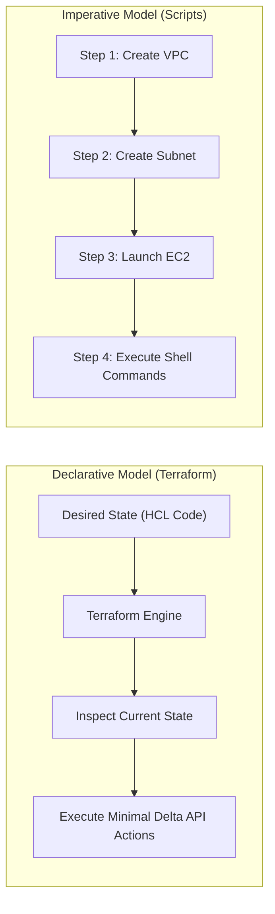
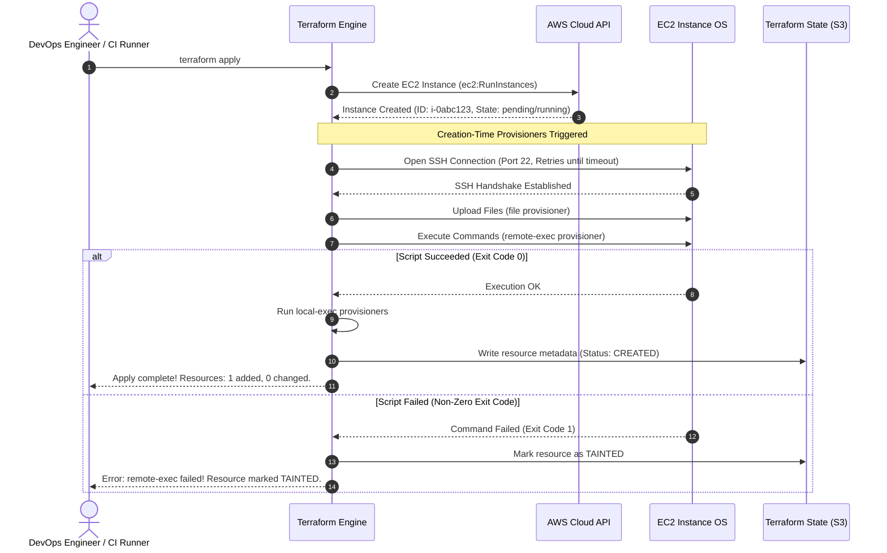

# 01. Infrastructure as Code & Terraform Provisioners Fundamentals

## 1. Introduction to Infrastructure as Code (IaC)

Infrastructure as Code (IaC) is the practice of defining, provisioning, managing, and versioning computing infrastructure through machine-readable definition files, rather than physical hardware configuration or interactive configuration tools.

### Declarative vs. Imperative Models

* **Declarative (Terraform, CloudFormation, Kubernetes manifests)**: You describe the desired **end-state** of the system. The orchestration engine determines the dependency graph, inspects current state, calculates the delta, and issues the exact API calls necessary to achieve the target state.
* **Imperative (Bash scripts, AWS CLI commands, Python boto3 scripts)**: You prescribe the explicit sequence of steps the computer must take to execute changes.

---

## 2. What Are Terraform Provisioners and Why Are They Used?

A **Provisioner** in Terraform is a mechanism used to execute scripts or shell commands either on a local machine (the workstation or CI/CD runner running Terraform) or on a remote machine (the provisioned cloud instance) to prepare servers or software for service.

### HashiCorp's Official Stance: The "Last Resort"

> [!CAUTION]
> **HashiCorp explicitly defines provisioners as a "last resort."**
> Terraform is designed to manage cloud infrastructure declaratively. Provisioners introduce **imperative, non-idempotent, side-effect-laden actions** that break Terraform's core guarantees.

### Why Provisioners Break Declarative Guarantees:
1. **No State Tracking of Changes**: Terraform does not record what a shell script does inside the operating system. If someone manually edits an Nginx config file or if an apt update installs a patch, `terraform plan` cannot detect the drift.
2. **Brittle Network Coupling**: A `remote-exec` provisioner requires direct SSH (port 22) or WinRM (port 5986) access from the machine running Terraform into the cloud VM. In hardened production environments, instances live in private subnets with no public ingress.
3. **The Tainted Resource Hazard**: If an EC2 instance launches successfully in AWS, but a subsequent `remote-exec` script encounters a temporary mirror timeout or package failure, Terraform marks the entire EC2 resource as **tainted**. On the subsequent `terraform apply`, Terraform will **terminate and recreate the virtual machine**, discarding data and causing downtime.

---

## 3. When Are Provisioners Legitimate in Real-World Operations?

Despite the architectural warnings, senior DevOps engineers encounter legitimate scenarios where provisioners solve edge cases:

| Scenario | Legitimate Provisioner Use | Recommended Cloud-Native Alternative |
| :--- | :--- | :--- |
| **Local Artifact Generation** | Using `local-exec` to generate dynamic Ansible inventories (`inventory.ini`), write local DNS mappings, or export metadata for downstream CI stages. | Terraform outputs consumed by CI pipeline scripts or dynamic inventory plugins (`aws_ec2.yml`). |
| **Legacy Bare-Metal / On-Prem VMs** | Bootstrapping virtualization platforms (VMware vSphere, OpenStack) that lack cloud-init or cloud metadata services. | Packer templates, PXE boot, or cloud-init ISO injection. |
| **Destroy-Time Node Deregistration** | Using `when = destroy` to revoke software licenses, unregister a node from a Consul cluster, or flush local logs to S3 before termination. | AWS Auto Scaling Lifecycle Hooks, Kubernetes graceful pod termination, or EC2 instance shutdown scripts. |
| **Smoke-Testing Endpoints** | Using `local-exec` to run `curl` or validation probes immediately after resource creation in ephemeral testing environments. | Post-apply CI/CD pipeline verification stages. |

---

## 4. Terraform Resource Lifecycle & Provisioner Execution Flow

Understanding the exact sequence of events during `terraform apply` is critical for diagnosing failed deployments.

### Lifecycle Rules:
1. **Creation-Time Provisioners (`when = create`, Default)**: Run only during resource creation. They do **not** re-run during subsequent updates unless the resource is replaced or wrapped in a `null_resource` whose `triggers` have changed.
2. **Destroy-Time Provisioners (`when = destroy`)**: Run **before** the cloud resource is destroyed. If a destroy provisioner fails and `on_failure = fail`, Terraform halts destruction, preventing the cloud resource from being deleted.
