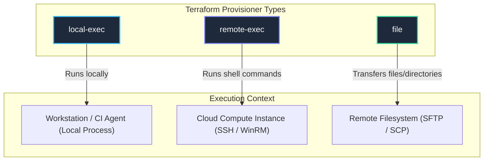

# 02. Terraform Provisioners Deep-Dive: Syntax, Types & Patterns

## 1. The Three Major Provisioner Types

Terraform provides three native provisioners. Each targets a specific runtime context and execution model.



---

## 2. `local-exec` Deep Dive

The `local-exec` provisioner invokes a local executable or shell process on the machine running Terraform.

### Complete Attribute Reference

| Attribute | Type | Default | Description |
| :--- | :--- | :--- | :--- |
| `command` | `string` | *(Required)* | The command string or script to execute. |
| `working_dir` | `string` | Current directory | Directory from which the process will be spawned. |
| `interpreter` | `list(string)` | System default shell | Custom interpreter binary and flags (e.g. `["/bin/bash", "-c"]` or `["python3", "-c"]`). |
| `environment` | `map(string)` | `{}` | Key-value pairs injected into the child process environment. |
| `on_failure` | `string` | `"fail"` | Behavior on exit code `!= 0` (`"continue"` or `"fail"`). |
| `when` | `string` | `"create"` | Execution lifecycle point (`"create"` or `"destroy"`). |

### Production Example: Triggering Ansible Playbook

```hcl
resource "aws_instance" "web" {
  ami           = data.aws_ami.amazon_linux_2023.id
  instance_type = "t3.micro"

  provisioner "local-exec" {
    command     = <<EOT
      echo "Waiting for SSH to become ready on ${self.public_ip}..."
      aws ec2 wait instance-status-ok --instance-ids ${self.id}
      ansible-playbook -i '${self.public_ip},' --private-key keys/deploy.pem playbooks/web.yml
    EOT
    interpreter = ["/bin/bash", "-c"]
    environment = {
      ANSIBLE_HOST_KEY_CHECKING = "False"
    }
    on_failure  = fail
  }
}
```

---

## 3. `remote-exec` Deep Dive

The `remote-exec` provisioner runs commands remotely over an SSH or WinRM connection established by a nested `connection` block.

### Execution Modes

1. **`inline`**: An ordered list of command strings executed inside a single remote shell session.
2. **`script`**: Path to a single local file copied to the remote system and executed.
3. **`scripts`**: An ordered list of local script paths executed sequentially.

```hcl
# Mode 1: Inline
provisioner "remote-exec" {
  inline = [
    "sudo dnf update -y",
    "sudo dnf install -y nginx",
    "sudo systemctl start nginx"
  ]
}

# Mode 2: Script
provisioner "remote-exec" {
  script = "${path.module}/scripts/setup-database.sh"
}
```

> [!WARNING]
> You cannot combine `inline` with `script` or `scripts` within the same `remote-exec` block.

---

## 4. `file` Provisioner Deep Dive

Copies files or entire folder hierarchies from the machine running Terraform to the remote machine.

### Supported Modes

```hcl
# Upload a single file
provisioner "file" {
  source      = "configs/app.conf"
  destination = "/tmp/app.conf"
}

# Upload an entire folder (Note: trailing slash rules apply!)
provisioner "file" {
  source      = "assets/"          # Copies contents of assets into /var/www/html/
  destination = "/tmp/site_assets"
}

# Upload dynamic in-memory string directly
provisioner "file" {
  content     = templatefile("${path.module}/configs/env.tpl", { port = 80 })
  destination = "/tmp/env.conf"
}
```

### The `/tmp/` Staging Pattern

In Linux environments, non-root users (like `ec2-user` or `ubuntu`) cannot write directly to `/etc/` or `/var/www/`.

```hcl
# Step 1: Copy to writable staging area
provisioner "file" {
  source      = "configs/nginx.conf"
  destination = "/tmp/nginx.conf"
}

# Step 2: Elevate privileges and move
provisioner "remote-exec" {
  inline = [
    "sudo mv /tmp/nginx.conf /etc/nginx/nginx.conf",
    "sudo chown root:root /etc/nginx/nginx.conf",
    "sudo chmod 0644 /etc/nginx/nginx.conf",
    "sudo systemctl restart nginx"
  ]
}
```

---

## 5. Terraform `connection` Blocks & SSH Bastion Tunneling

A `connection` block defines how Terraform connects to the remote machine for `file` and `remote-exec` provisioners.

### SSH Direct Connection

```hcl
connection {
  type        = "ssh"
  user        = "ec2-user"
  private_key = file("${path.module}/keys/id_rsa")
  host        = self.public_ip
  port        = 22
  timeout     = "5m"
  agent       = false
}
```

### Enterprise Bastion / Jumpbox Tunneling

In production environments, application servers reside in **private subnets** with no public IP address. Terraform must traverse an SSH Bastion host located in a public subnet:

```hcl
connection {
  type        = "ssh"
  user        = "ec2-user"
  private_key = file("${path.module}/keys/private_app.pem")
  host        = self.private_ip # Connects to private IP inside VPC
  timeout     = "10m"

  # Bastion / Jump Host Configuration
  bastion_host        = var.bastion_public_ip
  bastion_port        = 22
  bastion_user        = "ec2-user"
  bastion_private_key = file("${path.module}/keys/bastion.pem")
}
```

---

## 6. The `self` Object

Inside a provisioner or connection block, the `self` object refers to the parent resource. It allows you to access attributes without hardcoding resource identifiers:

* `self.id`: The unique ID of the instance (e.g., `i-0123456789abcdef0`).
* `self.public_ip`: Public IPv4 address.
* `self.private_ip`: Private IPv4 address.
* `self.triggers`: Key-value map on `null_resource` or `terraform_data`.

---

## 7. `on_failure` Behavior: Fail vs. Continue

| Value | Behavior | Production Recommendation |
| :--- | :--- | :--- |
| `on_failure = fail` *(Default)* | If the provisioner returns a non-zero exit code, Terraform marks the resource as **tainted** and halts execution. | Use when the provisioner performs critical bootstrapping (e.g. installing software, configuring database). |
| `on_failure = continue` | If the provisioner fails, Terraform logs a warning and proceeds with provisioning. The resource is **not** tainted. | Use for non-critical side effects (e.g. sending Slack notifications, writing optional local logs). |
