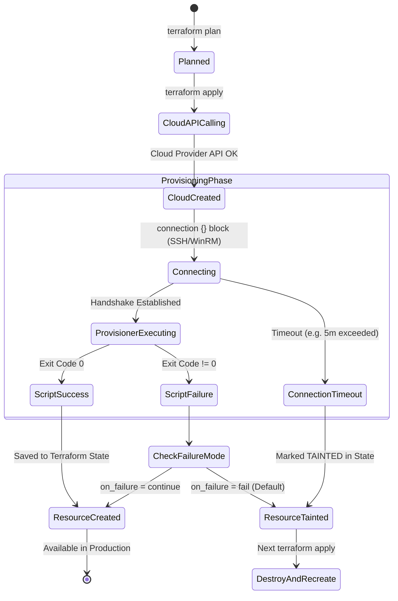
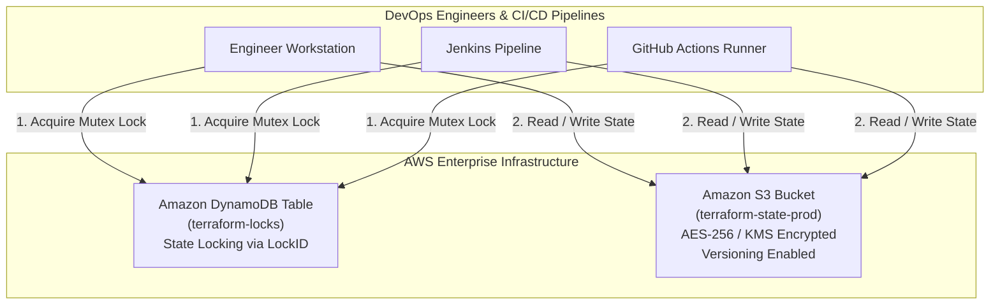
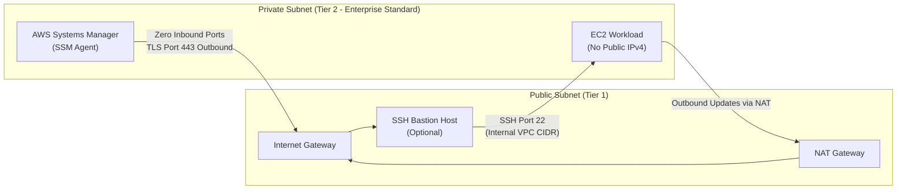

# 03. Resource Lifecycle, State Management & Security Architecture

## 1. Resource Lifecycle State Machine

When Terraform executes `terraform apply`, every resource with an attached provisioner passes through an explicit state machine:



---

## 2. The "Tainted" Resource Trap

When a provisioner fails with `on_failure = fail`, Terraform marks the resource as **tainted** (`"tainted": true` in JSON state).

### What Happens Next?
On the subsequent `terraform apply`:
1. Terraform notes that the resource is tainted.
2. Terraform issues an API call to **destroy the tainted cloud resource** (terminates the EC2 instance, discards attached non-persistent storage).
3. Terraform creates a **brand new instance** from scratch and re-runs all provisioners.

### Recovering from Tainted State in Production

```bash
# In Modern Terraform (v0.15.2+):
# Inspect state
terraform state list

# Untaint a resource without recreating it (if you manually resolved the issue)
terraform apply -replace="aws_instance.app"    # Explicit replacement
# Or if state allows:
terraform untaint module.ec2_app.aws_instance.app
```

> [!CAUTION]
> In an Auto Scaling Group or Production Database, recreating an instance because of a failed logging script can cause production outages. This is the primary reason senior DevOps architects wrap provisioners in a `null_resource` or migrate entirely to `user_data` / Packer.

---

## 3. Remote State Management: S3 & DynamoDB Locking

Storing Terraform state (`terraform.tfstate`) locally on a developer's laptop is dangerous:
- State contains sensitive data (private keys, generated passwords, IP addresses).
- Multiple team members running applies simultaneously can corrupt state files (race condition).
- Loss of laptop disk destroys infrastructure state tracking.

### Production Backend Architecture



### Complete S3 Backend Configuration

```hcl
terraform {
  backend "s3" {
    bucket         = "corp-production-terraform-state-us-east-1"
    key            = "compute/web-servers/terraform.tfstate"
    region         = "us-east-1"
    dynamodb_table = "corp-terraform-state-locks"
    encrypt        = true
  }
}
```

---

## 4. AWS Networking & SSH Security Hardening

To run `remote-exec` or `file` provisioners on an AWS EC2 instance, the network path between Terraform and the instance must be open on port 22.



### Enterprise Security Best Practices

1. **Never Allow `0.0.0.0/0` on Port 22**:
   - Ingress CIDRs must be restricted to enterprise VPN endpoints (`198.51.100.25/32`) or corporate IP ranges.
2. **IMDSv2 Enforcement**:
   - Set `http_tokens = "required"` and `http_put_response_hop_limit = 1` to prevent SSRF vulnerabilities from leaking AWS IAM credentials.
3. **IAM Instance Profiles (Least Privilege)**:
   - Attach IAM roles directly to instances using `aws_iam_instance_profile`. Avoid storing static AWS Access Keys (`AWS_ACCESS_KEY_ID`) on instances or inside provisioner scripts.
