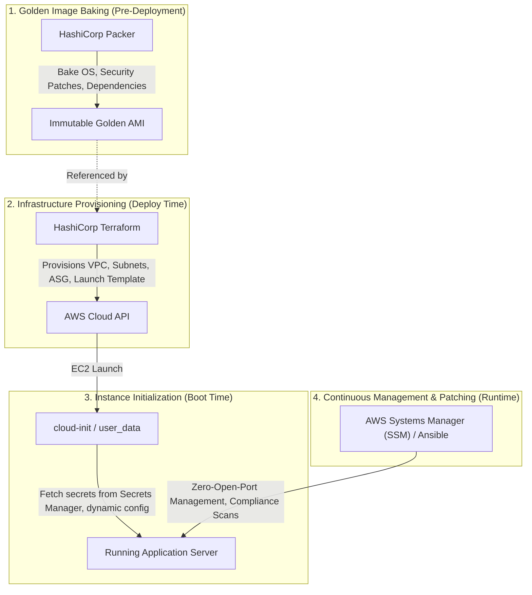

# 04. Production Alternatives to Terraform Provisioners

## 1. Architectural Separation of Concerns

A mature, enterprise-grade cloud architecture follows the **Unix Philosophy of DevOps**: *do one thing and do it well*.



---

## 2. Comprehensive Technology Comparison Matrix

| Dimension | Terraform Provisioners (`remote-exec`) | EC2 `user_data` / `cloud-init` | Ansible / Puppet | HashiCorp Packer (Golden AMIs) | AWS Systems Manager (SSM Run Command) |
| :--- | :--- | :--- | :--- | :--- | :--- |
| **Execution Point** | During `terraform apply` on local/CI | At initial instance boot by OS kernel | Post-boot over SSH or pull agent | Prior to deployment in CI image pipeline | On-demand at runtime via AWS API |
| **Open Inbound Ports Required** | **YES (Port 22 SSH or 5986 WinRM)** | **NO (0 inbound ports required)** | **YES (for push)** / **NO (for pull)** | **NO (in production)** | **NO (Zero inbound ports, outbound HTTPS 443 only)** |
| **Impact of Script Failure** | **Resource marked TAINTED; destroyed on next apply!** | Instance launches; errors logged to `/var/log/cloud-init.log` | Playbook fails; node remains running for inspection | AMI build fails in CI; zero impact on production | Command fails in SSM console; node remains online |
| **Execution Speed** | Slow (SSH handshake + compilation) | Moderate (runs during boot) | Moderate to Slow | **Fastest (pre-installed, boots in <60s)** | Fast |
| **Audit & Governance** | Minimal (local console output) | CloudWatch Logs agent | Centralized Ansible Tower / AWX | Immutable git commit + AMI lineage | **Full CloudTrail & SSM Session audit logs** |
| **Auto Scaling Group Compatibility** | **POOR (Cannot run when ASG scales out)** | **EXCELLENT (Runs automatically on every new node)** | Moderate (requires dynamic inventory / tags) | **EXCELLENT (Pre-baked for instant scaling)** | Good (via State Manager associations) |
| **Enterprise Production Rating** | ❌ **Anti-pattern / Last Resort** | ✅ **Standard for Bootstrapping** | ✅ **Standard for Mutable Config** | 🌟 **Gold Standard (Immutable Infra)** | 🌟 **Enterprise Standard (Zero-Trust)** |

---

## 3. Alternative 1: EC2 `user_data` with `cloud-init`

### Why It Replaces Provisioners
- Requires **zero open SSH inbound ports**.
- Executes automatically whenever an Auto Scaling Group launches replacement instances.
- Does **not** cause Terraform to mark instances as tainted if an application script fails.

### Terraform Implementation

```hcl
resource "aws_instance" "production_web" {
  ami           = data.aws_ami.amazon_linux_2023.id
  instance_type = "t3.micro"

  # Native cloud-init bootstrap script
  user_data = templatefile("${path.module}/scripts/bootstrap.sh", {
    app_port    = var.app_port
    environment = var.environment
  })

  user_data_replace_on_change = true # Terraform 1.2+ feature: Triggers replace only if user_data changes

  tags = {
    Name = "production-app-node"
  }
}
```

---

## 4. Alternative 2: HashiCorp Packer (Immutable Infrastructure)

Rather than installing packages on every server launch:
1. Build an AMI in a CI pipeline using Packer.
2. Install packages, security agents (Datadog, Wazuh, Falcon), and system dependencies during the build.
3. Deploy the AMI with Terraform. Launch times drop from 10 minutes to **under 45 seconds**.

### Packer Template Example (`app-ami.pkr.hcl`)

```hcl
packer {
  required_providers {
    amazon = {
      version = ">= 1.2.0"
      source  = "github.com/hashicorp/amazon"
    }
  }
}

source "amazon-ebs" "golden_image" {
  ami_name      = "golden-al2023-nginx-{{timestamp}}"
  instance_type = "t3.small"
  region        = "us-east-1"
  source_ami_filter {
    filters = {
      name                = "al2023-ami-2023.*-x86_64"
      root-device-type    = "ebs"
      virtualization-type = "hvm"
    }
    most_recent = true
    owners      = ["amazon"]
  }
  ssh_username = "ec2-user"
}

build {
  sources = ["source.amazon-ebs.golden_image"]

  provisioner "shell" {
    inline = [
      "sudo dnf update -y",
      "sudo dnf install -y nginx jq amazon-cloudwatch-agent",
      "sudo systemctl enable nginx"
    ]
  }
}
```

---

## 5. Alternative 3: AWS Systems Manager (SSM) Run Command

AWS Systems Manager allows you to run shell scripts, install software, and collect logs **without ever opening port 22 or distributing SSH private keys**.

```bash
# Execute remote shell command securely via AWS API:
aws ssm send-command \
    --document-name "AWS-RunShellScript" \
    --targets '[{"Key":"tag:Role","Values":["Web-Application"]}]' \
    --parameters 'commands=["sudo systemctl restart nginx"]' \
    --region us-east-1
```

All commands, outputs, and operator identity are logged in **AWS CloudTrail** and **SSM Audit Logs**, satisfying SOC2, HIPAA, and PCI-DSS compliance frameworks.
