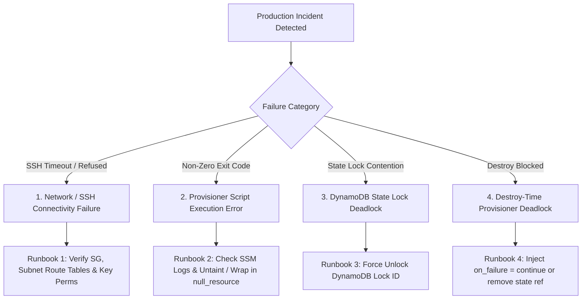
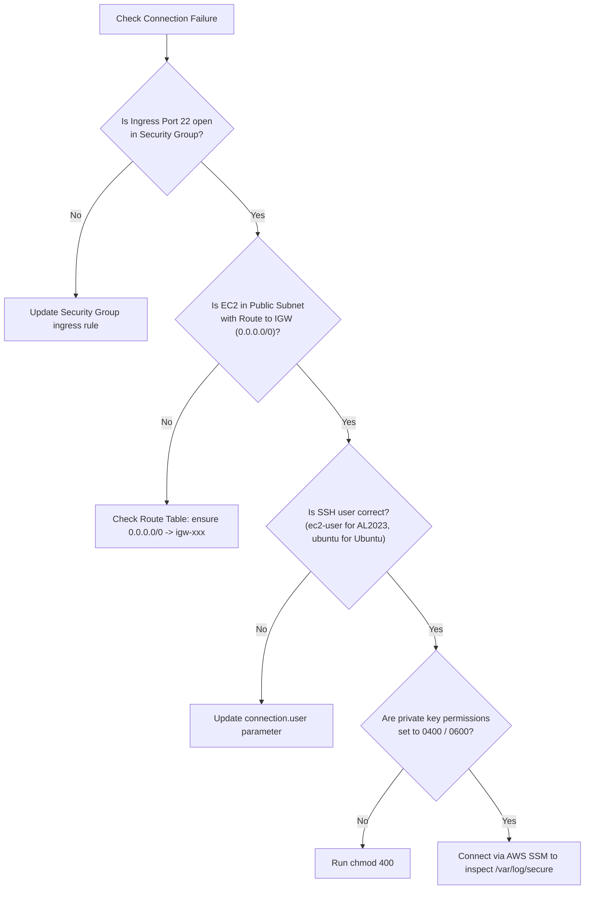

# 05. Production Incident Troubleshooting & Failure Recovery

This guide documents real-world production incident response runbooks based on 8–10 years of enterprise DevOps engineering experience.



---

## Incident Runbook 1: SSH Connection Timeout / Refused

### Symptoms
```text
Error: timeout - last error: dial tcp 54.210.12.34:22: i/o timeout
```

### Root Cause Triage Checklist



### Remediation Steps
1. **Verify Security Group**: Ensure your local IP (`curl ifconfig.me`) is included in `ssh_allowed_cidrs`.
2. **Verify Route Table**: If the subnet is public, verify that the route table has a route `0.0.0.0/0` targeted to the VPC `Internet Gateway` (`igw-xxxx`).
3. **Verify OS Username**:
   * Amazon Linux 2 / 2023: `ec2-user`
   * Ubuntu: `ubuntu`
   * RHEL / Rocky: `ec2-user` or `cloud-user`
   * Debian: `admin` or `root`
4. **Key Permissions**:
   ```bash
   chmod 0400 generated_keys/*.pem
   ```

---

## Incident Runbook 2: Script Execution Failure & Tainted Instance

### Symptoms
```text
Error: remote-exec provisioner error
Process exited with status 1
```

### Incident Flow & Recovery
1. **Identify the Tainted Resource**:
   ```bash
   terraform state list
   # Notice: module.ec2_app.aws_instance.app is tainted
   ```
2. **Diagnose the Remote Failure**:
   Connect to the instance via AWS SSM or SSH:
   ```bash
   aws ssm start-session --target i-0123456789abcdef0
   # Check bootstrap logs
   sudo cat /var/log/terraform-bootstrap.log
   sudo journalctl -xeu nginx
   ```
3. **Prevent Instance Destruction**:
   If the failure was transient (e.g. temporary yum mirror timeout) and the node is actually healthy:
   ```bash
   # Remove tainted flag in Terraform
   terraform untaint module.ec2_app.aws_instance.app
   ```
4. **Long-Term Production Fix**:
   Decouple the provisioner from the `aws_instance` into a separate `null_resource`:
   ```hcl
   resource "null_resource" "app_bootstrap" {
     triggers = {
       instance_id = aws_instance.app.id
     }
     # provisioner blocks placed here
   }
   ```

---

## Incident Runbook 3: DynamoDB State Lock Deadlock

### Symptoms
```text
Error: Error acquiring the state lock
ConditionalCheckFailedException: The conditional request failed
Lock Info:
  ID:        b7f32991-8840-410a-ba2f-f4f910404ef8
  Path:      corp-terraform-state/dev/terraform.tfstate
  Who:       runner@github-actions
  Created:   2026-10-01 10:14:02 UTC
```

### Root Cause
A CI/CD runner crashed or was abruptly killed before it could release the DynamoDB lock, leaving a lingering `LockID` entry.

### Remediation
1. Verify that no other pipeline or teammate is actively applying changes.
2. Force-unlock the state using the Lock ID reported in the error message:
   ```bash
   terraform force-unlock b7f32991-8840-410a-ba2f-f4f910404ef8
   ```

---

## Incident Runbook 4: Destroy-Time Provisioner Deadlock

### Symptoms
```bash
terraform destroy
# Hangs indefinitely or errors:
Error: remote-exec provisioner error: dial tcp: connection refused
```

### Root Cause
When destroying resources, the server's network interfaces, security groups, or SSH daemon may terminate before the destroy provisioner runs, or the external target is offline.

### Remediation
1. Always set `on_failure = continue` on destroy-time provisioners:
   ```hcl
   provisioner "remote-exec" {
     when       = destroy
     inline     = ["./deregister.sh"]
     on_failure = continue # Prevents deadlock!
   }
   ```
2. If currently blocked, remove the resource from the Terraform state and manually clean up the cloud resource:
   ```bash
   terraform state rm null_resource.destroy_cleanup
   terraform destroy -auto-approve
   ```
